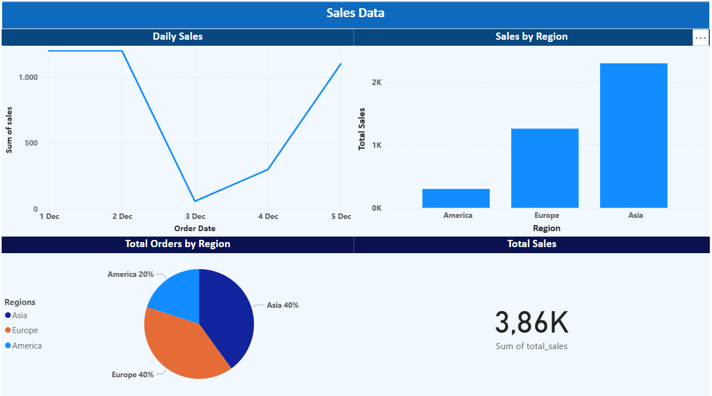

# **Sales Data Analytics Project**

This project demonstrates an end-to-end Data Engineering pipeline using Databricks, PySpark, Delta Lake, and Power BI.
Raw CSV files are processed through the Bronze–Silver–Gold architecture, and the curated Gold tables are visualized in a Power BI dashboard.

## **Project Workflow**

### Upload raw CSV to Databricks Volumes

### Load data into Bronze layer

- Used spark.read.csv() to read raw data
- Stored as Delta tables

### Silver layer transformations

- Cleaned data
- Casted order_date to date format
- Added computed fields (total_amount)

### Gold layer aggregation

- Daily sales
- Sales by region
- Total orders

### Power BI Visualization

- Connected Power BI → Databricks SQL Warehouse
- Imported Gold tables
- Built Sales Analytics Dashboard

### Architecture Diagram
Raw CSV → Bronze (Raw) → Silver (Cleaned) → Gold (Aggregated) → Power BI Dashboard

### Tech Stack

- Databricks
- PySpark
- Delta Lake
- SQL Warehouse
- Power BI
- Dashboard Preview

### Below is the visualization created in Power BI:

